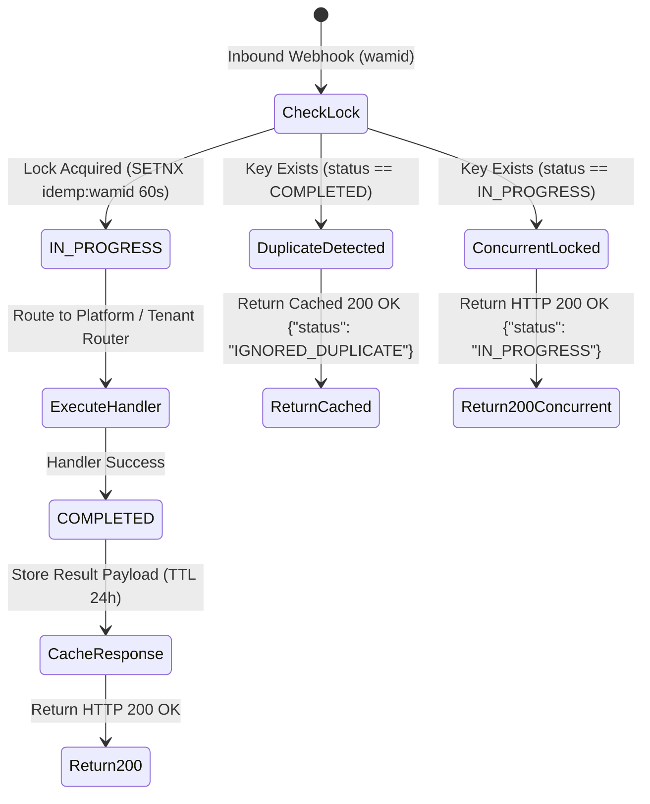

# Design Document & Implementation Checklist: Idempotency Layer (P0.5)

**Document Status**: APPROVED FOR IMPLEMENTATION PLANNING  
**Milestone**: Production E2E, Failure Testing, & Idempotency Certification (P0.5)  
**Target Module**: `app/whatsapp/traffic_splitter.py`, `app/core/idempotency.py`  
**Author**: Antigravity AI & BoonTrack Engineering  
**Reviewed by**: CTO  

---

## 1. Context & Motivation

Meta WhatsApp Cloud API implements an **at-least-once delivery guarantee** for webhook events. In real-world network conditions (e.g., transient network timeouts, HTTP 504 gateway timeouts, or container restarts), Meta inevitably replays the exact same webhook event with identical message identifiers (`wamid`).

### Risks Without Idempotency Gate:
1. **Duplicate Activation**: If an activation webhook (`AKTIVASI BT-xxxx`) is delivered twice in quick succession:
   - Race conditions may occur during database record transitions.
   - Redundant outbound WhatsApp messages are dispatched, consuming Meta tier credits and confusing the merchant.
2. **Duplicate Transactional Processing**: For transactional alerts (payment settlements):
   - Multiple status updates, ledger discrepancies, or duplicated affiliate commission credits could occur.
3. **Resource Waste**: Re-evaluating regex, database lookups, and external service calls for already-processed messages wastes CPU and I/O cycles.

---

## 2. Architecture & Design Specifications

### 2.1. Deduplication Key Formulation
Meta Cloud API assigns a globally unique ID for every message:
```json
{
  "entry": [{
    "changes": [{
      "value": {
        "messages": [{
          "id": "wamid.HBgNNjI4MTIzNDU2NzE3MB..."
        }]
      }
    }]
  }]
}
```

- **Key Format**: `idemp:wamid:{provider_message_id}`
- **Example**: `idemp:wamid:wamid.HBgNNjI4MTIzNDU2NzE3MB...`
- **Fallback Key** (if message ID is absent): SHA-256 hash of `sender_phone + raw_text + timestamp`

### 2.2. Two-Tier Storage Architecture

```
[ Inbound Webhook (wamid) ]
            │
            ▼
    [ Idempotency Guard ]
     ├── 1. Distributed Cache (Redis) ── TTL: 86,400s (24h)
     │       └── Key: idemp:wamid:{wamid}
     │           States: "IN_PROGRESS" | "COMPLETED"
     ├── 2. In-Memory LRU Cache (Fallback when Redis unavailable)
     │       └── Capacity: 50,000 keys | TTL: 86,400s
     └── 3. Database Audit Table (PostgreSQL / Supabase)
             └── Table: processed_webhook_events
```

### 2.3. State Transition Machine & Concurrency Control

The Idempotency Guard implements a **Two-Phase Lock (2PL)**:



1. **Phase 1 (Acquire)**:
   - Run atomic `SET idemp:wamid:{wamid} "IN_PROGRESS" NX EX 60`.
   - If key already exists:
     - If value contains cached payload: Return cached response directly (**Early Return HTTP 200 OK**).
     - If value == `"IN_PROGRESS"`: Another worker is processing this event. Return HTTP 200 OK to acknowledge Meta without duplicate processing.
2. **Phase 2 (Release / Commit)**:
   - Handler finishes execution.
   - Run `SET idemp:wamid:{wamid} "{serialized_result_payload}" EX 86400`.
   - If handler raises an uncaught exception, delete the lock key (`DEL idemp:wamid:{wamid}`) to allow subsequent Meta retries to recover.

---

## 3. Database Audit Schema (`processed_webhook_events`)

```sql
CREATE TABLE IF NOT EXISTS processed_webhook_events (
    id UUID PRIMARY KEY DEFAULT gen_random_uuid(),
    provider_message_id VARCHAR(255) NOT NULL UNIQUE,
    phone_number_id VARCHAR(64) NOT NULL,
    sender_phone VARCHAR(32) NOT NULL,
    route_type VARCHAR(64) NOT NULL, -- 'PLATFORM_TRANSACTIONAL' | 'TENANT_SALES'
    action_type VARCHAR(64) NOT NULL, -- 'store_activation' | 'payment_alert' | 'catalog_inquiry'
    status VARCHAR(32) NOT NULL,      -- 'SUCCESS' | 'REJECTED' | 'FAILED'
    response_payload JSONB,
    processed_at TIMESTAMPTZ DEFAULT NOW(),
    created_at TIMESTAMPTZ DEFAULT NOW()
);

CREATE INDEX IF NOT EXISTS idx_webhook_events_wamid ON processed_webhook_events(provider_message_id);
CREATE INDEX IF NOT EXISTS idx_webhook_events_created ON processed_webhook_events(created_at);
```

---

## 4. Implementation Checklist

### Phase 1: Storage & Utilities
- [ ] **Core Module**: Create `app/core/idempotency.py` with `IdempotencyManager` class.
- [ ] **Redis Adapter**: Implement async Redis connection with automatic fallback to in-memory TTLCache.
- [ ] **Locking Primitives**: Implement `acquire_lock(wamid, ttl=60)` and `commit_result(wamid, payload, ttl=86400)`.
- [ ] **Release on Error**: Ensure `release_lock(wamid)` is called if execution raises an unexpected error.

### Phase 2: Platform Handler Integration
- [ ] **Activation Handler**: Hook idempotency check before `_process_activation`:
  - If `wamid` is duplicate: Return cached response, skip Supabase writes and skip `send_whatsapp_text`.
- [ ] **Transactional Alert Handler**: Hook idempotency check before payment event processing.

### Phase 3: Observability & Telemetry
- [ ] **Prometheus Metrics**:
  - `webhook_idempotency_hits_total{route="platform", action="activation"}`
  - `webhook_idempotency_concurrent_locks_total`
- [ ] **Structured Logging**:
  - `logger.info(f"[IdempotencyGuard] Duplicate event detected for wamid={wamid}. Returning cached response.")`

### Phase 4: Production Certification
- [ ] Benchmark latency impact (< 2ms for Redis check).
- [ ] Execute 3x concurrent burst stress test with identical `wamid`.
- [ ] Validate zero duplicate WhatsApp outbound messages.
