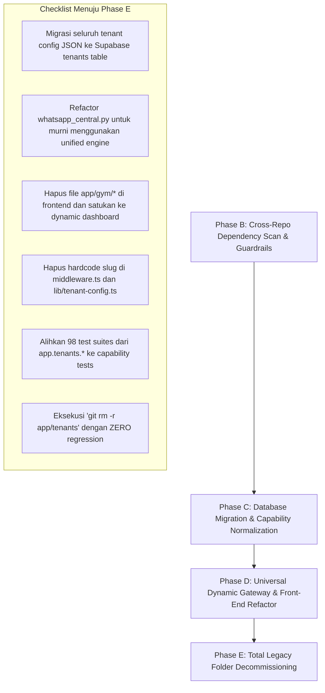

# 🗺️ Cross-Repo Dependency Map & Migration Blueprint (Phase B)

> **Document Status**: Active Reference / Phase B Architectural Audit  
> **Target Removal Date (Phase E)**: Permanent decommissioning of `app/tenants/*`  
> **Enforced Guardrails**: See `ARCHITECTURE.md` Section 0.1 (*Tri-Rule Database-Driven Multi-Tenant Constitution*)

---

## 1. Executive Summary & Context

Sesuai arahan arsitektur CTO BoonTrack, platform bertransisi dari arsitektur *file-based tenant* (`app/tenants/*`) menuju **database-driven multi-tenant terpadu**:
1. **Source of Truth**: Seluruh identitas toko, kategori bisnis (`business_type`), konfigurasi persona AI, integrasi pembayaran, dan kapabilitas sistem dikelola dinamis di database Supabase (`tenants` table).
2. **Context Driven**: Modul runtime di-drive oleh `TenantRuntimeContext`, `capabilities` (misal: `shipping`, `booking`, `digital_fulfillment`, `iot_turnstile`), dan `business_type` (`PHYSICAL`, `DIGITAL`, `FIELD_SERVICE`, `MEMBERSHIP`).
3. **Anti-Hardcode**: Menghapus seluruh percabangan statis berbasis slug toko (misal: `if tenant == 'gym'` atau `if slug in ['om_budi', 'career']`).

Dokumen ini memetakan seluruh ketergantungan warisan (*legacy dependencies*) di repositori backend `boontrack-core` dan repositori frontend `boontrack-inbox` yang harus dimigrasikan sebelum folder `app/tenants/*` resmi dihapus pada **Phase E**.

---

## 2. Backend Dependency Map (`boontrack-core`)

### 2.1 File Non-Test yang Mengimpor `app.tenants.*`

Berikut adalah daftar file inti backend yang masih mengimpor atau memanggil modul di dalam `app/tenants/*`:

| File Path | Modul/Simbol yang Diimpor | Konteks & Logika Saat Ini | Target Refaktor (Phase E) |
|---|---|---|---|
| `app/core/tenant_loader.py` | `app.tenants.gym.router` `app.tenants.career.router` `app.tenants.om_budi.router` `app.tenants.pelayanan_publik.router` `app.tenants.bale_pananggeuhan.router` | `TENANT_REGISTRY` mendaftarkan router statis per folder tenant ke aiohttp runner. | Hapus `TENANT_REGISTRY` statis. Gunakan `GenericTenantEngine` & router universal (`/api/v1/shop/{tenant_slug}/*`) yang membaca `TenantRuntimeContext` dari DB. |
| `app/routes/whatsapp_central.py` | `app.tenants.om_budi.service.om_budi_service` `app.tenants.career.service.career_service` `app.tenants.gym.service.gym_service` | Webhook Meta Cloud API melakukan branching manual jika `phone_id` atau `tenant_slug` cocok dengan Om Budi, Career, atau Gym. | Delegasikan seluruh inbound WhatsApp ke `unified_engine_core` atau `commerce_ai_engine` yang membaca persona dan instruksi dari `tenants.metadata.persona`. |
| `app/routes/whatsapp_career.py` | `app.tenants.career.service.career_service` | Handler khusus untuk webhook WhatsApp pipeline karir/CV ATS. | Migrasikan pipeline review CV ke modul kapabilitas Core (`app/services/document_engine.py` dengan capability `document_fulfillment`). |
| `app/routes/meta_whatsapp.py` | `app.tenants.om_budi.service.om_budi_service` `app.tenants.career.service.career_service` | Router legacy WhatsApp Cloud API. | Deprecated / Alihkan ke `whatsapp_gateway_routes.py` (Evolution API Baileys universal engine). |
| `app/services/agent_service.py` | `app.tenants.om_budi.service.om_budi_service` `app.tenants.career.service.career_service` | `process_incoming_message` memanggil service Om Budi & Career secara langsung jika terdeteksi slug terkait. | Gantikan dengan kueri dinamis `onboarding_service.get_tenant_details_by_slug(tenant_slug)` dan `commerce_ai_engine`. |
| `app/payments/matcher.py` | `app.tenants.om_budi.config` / `service` | Pencocokan mutasi bank manual BCA/Mandiri untuk rekening Om Budi. | Gunakan pencocokan mutasi dinamis berdasarkan rekening settlement toko di database (`tenants.metadata.payout_accounts`). |
| `app/routes/payment_webhook.py` | `app.tenants.om_budi.service` | Webhook pembayaran mutasi DANA khusus Om Budi. | Universal payment callback berbasis `external_id` / `invoice_id` (`app/routes/webhook_payment.py`). |
| `app/core/channels/telegram.py` | `app.tenants.digicorn.config.DIGICORN_TELEGRAM_TOKEN` | Token bot Telegram di-hardcode dari modul Digicorn. | Ambil token bot dari environment variable atau `tenants.metadata.telegram_bot_token`. |
| `app/modules/commerce/catalog.py` | `app.tenants.om_budi.catalog_data` | Fallback data katalog jika database Supabase kosong. | Hapus fallback import statis. Wajib throw atau return empty list jika Supabase tidak memiliki produk. |

---

### 2.2 Endpoint & Service dengan Percabangan Slug Hardcode

File-file berikut tidak mengimpor `app/tenants/*` secara langsung, namun memiliki percabangan logika hardcode (string checking `tenant == '...'` atau default fallback ke slug tertentu):

| File Path | Slug yang Di-hardcode | Bentuk Pelanggaran Logika | Solusi Pembersihan |
|---|---|---|---|
| `app/routes/whatsapp_gateway_routes.py` | `"onlineboost"`, `"suhu-ads-masterclass"`, `"suhu_ads"` | Fallback: `if raw_tenant in ("suhu-ads-masterclass", "suhu_ads"): tenant_slug = "onlineboost"` dan default `"onlineboost"`. | Hilangkan alias hardcode. Gunakan slug yang tersimpan di database atau return error jika slug tidak terdaftar. |
| `app/services/whatsapp_service.py` | `"om_budi"`, `"om-budi"`, `"aduan"`, `"aduan-sandbox"`, `"career"`, `"boontrack-career"` | Hardcode phone number ID Meta dan normalisasi tenant slug pada fungsi `log_to_supabase_messages`. | Simpan `whatsapp_phone_number_id` di kolom `tenants.phone` atau `metadata.waba_phone_id`. |
| `app/services/tenant_context_resolver.py` | `"kurastorenkrw"`, `"onlineboost"` | Default mock resolver jika context resolver gagal menemukan slug. | Hentikan default slug statis. Return `None` atau throw `TenantNotFoundError`. |
| `app/schemas/context.py` | `"kurastorenkrw"` | Schema default field `tenant_slug: str = "kurastorenkrw"`. | Ganti default menjadi `Field(..., description="Tenant slug wajib diisi")`. |
| `app/main.py` | `"kurastorenkrw"` | `get_store_ads_config(tenant_slug: str = "kurastorenkrw")` dan endpoint aiohttp ads-config. | Gunakan query parameter dinamis `tenant_slug` tanpa default hardcode. |
| `app/api/endpoints/gym.py` `app/routes/gym_access_routes.py` `app/routes/gym_admin_routes.py` `app/services/gym_access_service.py` | `"atmosfitnes"`, `"gym"` | Endpoint dan service IoT turnstile gate access diikat kaku ke slug `atmosfitnes` alih-alih membaca capability `iot_turnstile`. | Parameterisasi rute menjadi `/api/v1/iot/{tenant_slug}/turnstile/*` dan validasi `capabilities.iot_turnstile === true`. |
| `app/handlers/cv_flow.py` `app/services/document_engine.py` | `"career"`, `"boontrack-career"` | Workflow bot Telegram dan scoring CV terikat kaku pada slug `career`. | Buat generic workflow engine berbasis `capabilities.cv_scoring`. |
| `app/configs/tenants/*.json` | `om_budi.json`, `career.json`, `atmosfitnes.json` | Konfigurasi toko disimpan di file JSON lokal di disk container. | Migrasikan seluruh konfigurasi ke tabel `tenants` di database Supabase (Phase C/D). |

---

### 2.3 Unit & Integration Tests yang Terikat pada `app.tenants.*`

Terdapat **98 file/baris pengujian** yang menguji langsung modul di `app/tenants/*`. Sebelum menghapus `app/tenants/*` di Phase E, pengujian ini harus dialihkan ke pengujian Generic Tenant Engine:
- `tests/test_om_budi_service.py` → Ubah menjadi `test_generic_commerce_engine.py` dengan mock payload DB.
- `tests/test_gym_tenant.py` & `tests/test_gym_conversational_e2e.py` → Ubah menjadi pengujian `capabilities.membership` & `capabilities.iot_turnstile`.
- `tests/test_career_modular.py` & `tests/test_cfo_approved_engine.py` → Ubah menjadi pengujian generic document review.
- `tests/test_tenant_architecture.py` & `tests/test_reliability_isolation.py` → Hapus mock module `app.tenants.broken_dummy_tenant`.

---

## 3. Frontend Cross-Dependency Map (`boontrack-inbox`)

### 3.1 Folder Rute Khusus Vertikal (`app/gym/*`)

Frontend memiliki **1 dedicated route tree** yang didedikasikan untuk satu tenant fisik (`atmosfitnes`):

| File Path Frontend | Ketergantungan Statis | Target Refaktor (Phase E) |
|---|---|---|
| `app/gym/layout.tsx` | Hardcode instance `{ id: 'atmosfitnes', name: 'Atmosfitnes Hub' }`. | Hapus `/app/gym/*`. Satukan layout ke dalam `app/[tenant]/dashboard/*`. |
| `app/gym/page.tsx` | Memanggil `getGymStats('atmosfitnes')`, `getGateControllers('atmosfitnes')`. | Render sebagai tab/komponen dashboard jika `tenant.business_type === 'MEMBERSHIP'` dan `capabilities.iot_turnstile === true`. |
| `app/gym/members/page.tsx` | Memanggil API member card pairing dengan argumen `'atmosfitnes'`. | Komponen `MemberList.tsx` di `app/[tenant]/dashboard/components/modules/membership/`. |
| `app/gym/classes/page.tsx` | Memanggil `getGymClasses('atmosfitnes')`. | Komponen `ClassBooking.tsx` di `app/[tenant]/dashboard/components/modules/membership/`. |
| `app/gym/controllers/page.tsx` | Hardcode gate unlock trigger ke `'atmosfitnes'`. | Komponen `TurnstileGate.tsx` modular. |
| `app/gym/pos/page.tsx` | POS transaksi hardcode `'atmosfitnes'`. | Manfaatkan modul POS/Kasir standar `app/[tenant]/dashboard/components/modules/pos/`. |
| `app/gym/access-logs/page.tsx` `app/gym/invoices/page.tsx` `app/gym/reports/page.tsx` `app/gym/settings/page.tsx` | Hardcode tenant id `'atmosfitnes'`. | Pindahkan ke tab reporting/settings standar dashboard tenant. |
| `lib/gym-api.ts` | Default fallback: `const DEFAULT_TENANT_ID = 'atmosfitnes'`. | Gunakan context `tenantSlug` dari `useTenantDashboard()` tanpa fallback `'atmosfitnes'`. |

---

### 3.2 File Konfigurasi Statis & Komponen Landing Page Khusus

| File Path Frontend | Bentuk Hardcode | Dampak Arsitektural | Solusi Pembersihan |
|---|---|---|---|
| `lib/tenant-config.ts` | Menyimpan objek dictionary konfigurasi statis untuk `'onlineboost'`, `'atmosfitnes'`, `'om-budi'`, `'career'`, dll. (16 occurrences). | Mengaburkan database sebagai single source of truth. Perubahan config di Supabase tidak tercermin jika tertimpa file ini. | Gantikan pembacaan config sepenuhnya dari endpoint `/api/v1/tenants/[slug]` atau `TenantRuntimeContext`. |
| `components/OnlineBoostLandingPage.tsx` | Halaman landing page khusus toko `onlineboost`. | Vertikal tidak boleh memiliki landing page statis sendiri di Core frontend. | Jadikan landing page toko sebagai template storefront dinamis (`storefront_template: 'DIGITAL_HERO'`). |
| `middleware.ts` | Regex matching hardcode list: `'atmosfitnes'`, `'suhu-ads'`, `'bale-pananggeuhan'`, `'pelayanan-publik'`, `'om-budi'`. | URL rewrite kaku. Tenant baru yang mendaftar mandiri tidak tercover jika belum didaftarkan di array ini. | Dynamic Subdomain & Path Rewrite: Rewrite semua subdomain/path ke generic dynamic route `app/[tenant]/*` via database lookup / Cloudflare KV cache. |
| `app/admin/page.tsx` `app/admin/shops/page.tsx` `app/admin/push-notification/page.tsx` `app/api/v1/admin/push/broadcast/route.ts` | Filter string hardcode: `slug === 'atmosfitnes' \|\| slug.includes('atmos')`, `slug.includes('career')`, `slug.includes('digicorn')`. | Superadmin memfilter kategori toko berdasarkan string matching nama slug toko. | Filter menggunakan kolom `business_type` (`PHYSICAL`, `DIGITAL`, `FIELD_SERVICE`, `MEMBERSHIP`) dan `plan_tier`. |

---

## 4. Phase E Decommissioning Checklist

Sebelum folder `c:\boontrack-core\app\tenants\` dapat dihapus secara permanen (`rmdir /s /q app\tenants`), tim wajib menyelesaikan checklist berikut:

### Checklist Tahapan:
- [x] **Phase B (Current)**:
  - [x] Tambahkan 3 Golden Rules ke `ARCHITECTURE.md` Section 0.1.
  - [x] Terbitkan peta dependensi lengkap `docs/phase_b_dependency_map.md`.
- [ ] **Phase C (Database & Schema Realignment)**:
  - [ ] Pastikan seluruh tenant eksisting (`om_budi`, `career`, `atmosfitnes`, `digicorn`, `kurastorenkrw`) memiliki baris valid di Supabase dengan kolom `business_type` dan `capabilities` terisi lengkap.
  - [ ] Hapus folder `app/configs/tenants/*.json`.
- [ ] **Phase D (Decoupling & Routing Neutralization)**:
  - [ ] Hilangkan percabangan manual di `whatsapp_central.py`, `agent_service.py`, `matcher.py`, dan `payment_webhook.py`.
  - [ ] Refactor frontend `boontrack-inbox` agar mengonsumsi `capabilities` dari `useTenantDashboard.ts` (sudah dimulai pada commit terbaru: `storeCategory`, `businessType`, `capabilities`).
  - [ ] Pindahkan halaman `/gym/*` ke modular registry dashboard.
- [ ] **Phase E (Final Deletion)**:
  - [ ] Hapus seluruh folder `app/tenants/*`.
  - [ ] Verifikasi automated CI/CD pipeline lulus 100% tanpa referensi ke `app.tenants`.
